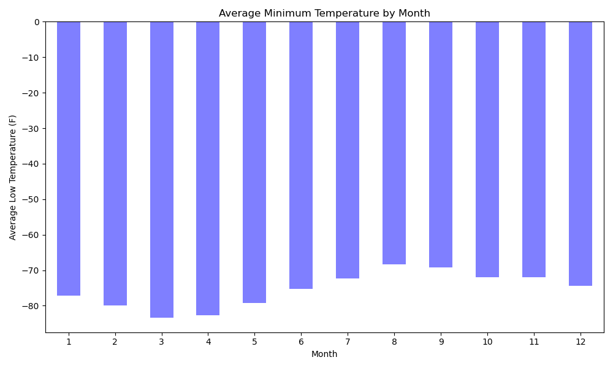
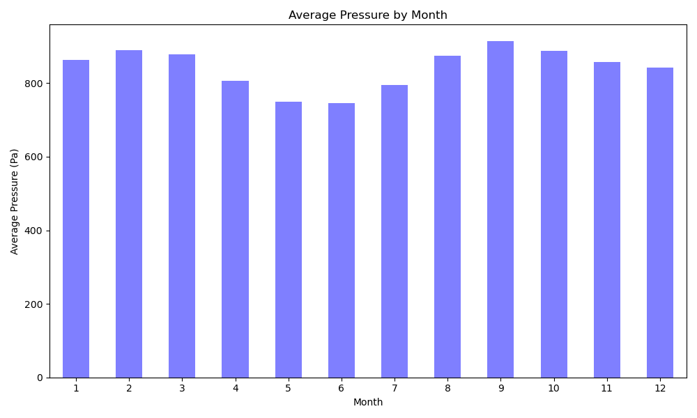
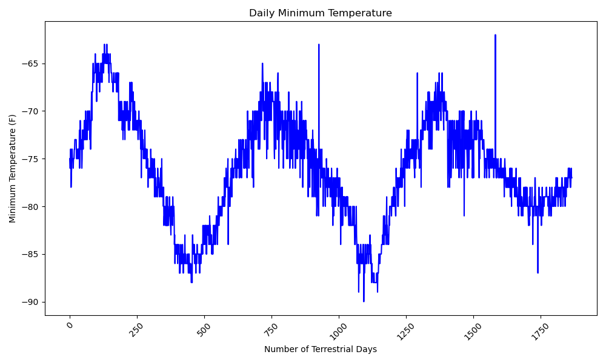

# web-scraping and data analysis

To complete this task, I will use Splinter for automated web browsing and Beautiful Soup for parsing HTML. The goal is to carefully identify different HTML elements on a webpage, along with their corresponding IDs and class attributes. This understanding will help me efficiently extract specific information, such as HTML tables or recurring elements like multiple news articles found on the webpage.

**This challenge consists of two technical products.**

* Deliverable 1: Scrape titles and preview text from Mars news articles.

    * Use automated browsing to visit the Mars news site. Inspect the page to identify which elements to scrape.
    * Create a Beautiful Soup object and use it to extract text elements from the website.
    * Extract the titles and preview text of the news articles that you scraped. 
    * Store the scraping results in Python data structures
    * Store all the dictionaries in a Python list.
    * Print the list in your notebook.
    * Store each title-and-preview pair in a Python dictionary and, give each dictionary two keys: title and preview.

    * 

* Deliverable 2: Scrape and analyze Mars weather data, which exists in a table.
    * Use automated browsing to visit the Mars Temperature Data Site. Inspect the page to identify which elements to scrape.
    * Create a Beautiful Soup object and use it to scrape the data in the HTML table. 
    * Assemble the scraped data into a Pandas DataFrame. The columns should have the same headings as the table on the website. Here’s an explanation of the column headings:

        * id: the identification number of a single transmission from the Curiosity rover
        * terrestrial_date: the date on Earth
        * sol: the number of elapsed sols (Martian days) since Curiosity landed on Mars
        * ls: the solar longitude
        * month: the Martian month
        * min_temp: the minimum temperature, in Celsius, of a single Martian day (sol)
        * pressure: The atmospheric pressure at Curiosity's location

    * Examine the data types that are currently associated with each column. If necessary, cast (or convert) the data to the appropriate datetime, int, or float data types
    * Analyze your dataset by using Pandas functions to answer the following questions:

        * How many months exist on Mars?
        * How many Martian (and not Earth) days worth of data exist in the scraped dataset?
        * What are the coldest and the warmest months on Mars (at the location of Curiosity)? To answer this question:
            * Find the average minimum daily temperature for all of the months.
            * Plot the results as a bar chart.
            * 
        * Which months have the lowest and the highest atmospheric pressure on Mars? To answer this question:
            * Find the average daily atmospheric pressure of all the months.
            * Plot the results as a bar chart.
            * 
        * About how many terrestrial (Earth) days exist in a Martian year? To answer this question:
            * Consider how many days elapse on Earth in the time that Mars circles the Sun once.
            * Visually estimate the result by plotting the daily minimum temperature of each observation.
            * 
    * Export the DataFrame to a CSV file.
        * 